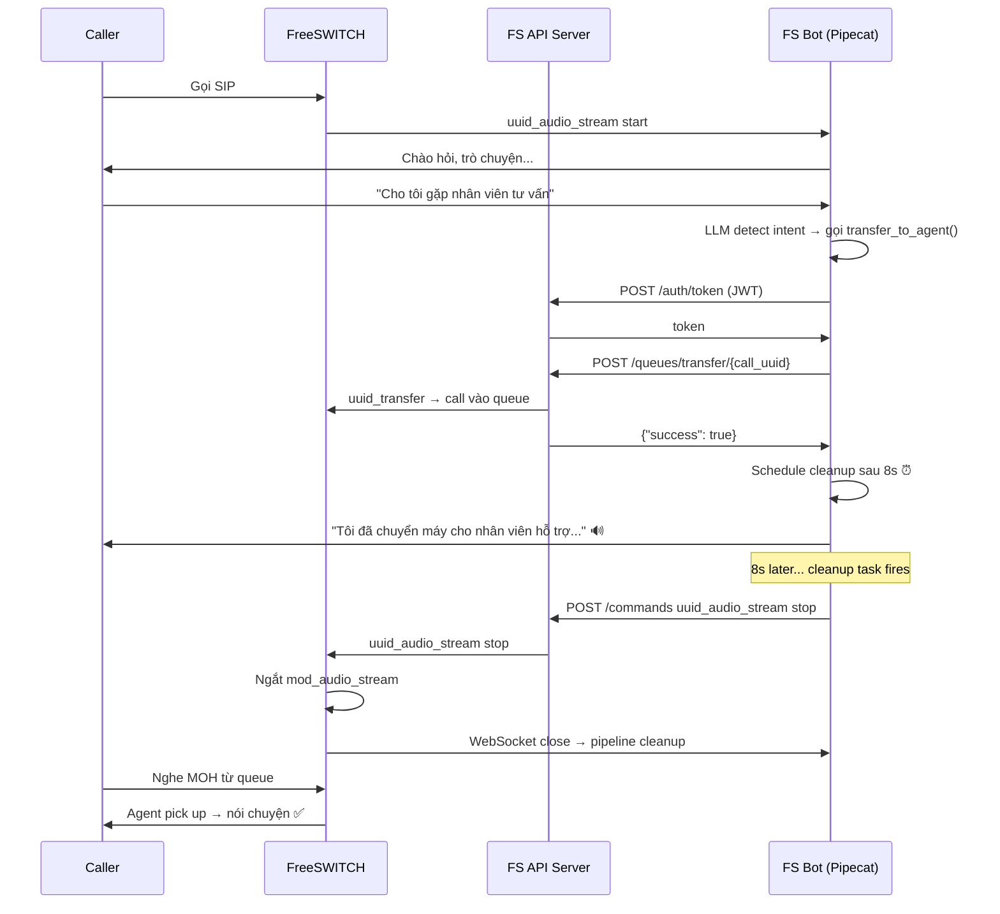

# Tool Calling — Transfer Cuộc Gọi Đến Queue Tổng Đài
## Tài Liệu Kiến Trúc, Triển Khai, Bug Fix & Hướng Dẫn Sử Dụng

> **Cập nhật:** 2026-07-30
> **Phiên bản code:** fs_tools.py + bot_fs.py
> **Tác giả:** Claude Code

---

## 1. Mục Tiêu

Khi khách hàng nói với bot các câu như "cho tôi gặp nhân viên tư vấn", "chuyển máy cho tổng đài viên", "gọi điện thoại viên", bot sẽ:
1. Nhận diện ý định qua LLM function calling
2. Gọi REST API để chuyển cuộc gọi vào queue `support@default` của FreeSWITCH Call Center
3. Thông báo cho khách hàng trước khi ngắt kết nối
4. Ngắt `mod_audio_stream` để caller có thể nói chuyện với agent qua queue

---

## 2. Kiến Trúc Tổng Thể



### 2.1. Vai trò các thành phần

| Thành phần | Vai trò |
|------------|---------|
| **FS Bot (Pipecat)** | Nhận diện giọng nói, LLM, TTS, tool calling |
| **FS API Server** | REST API wrapper cho FreeSWITCH ESL (ESL connection pool) |
| **FreeSWITCH** | Xử lý cuộc gọi, callcenter queue, uuid_audio_stream |

### 2.2. Tool Calling Flow (Pipecat 1.5.0)

```
LLMContext(tools=[transfer_handler]) → LLM service auto-register
  → User nói → VAD → STT → user_agg → LLMContextFrame
  → LLM service sync tools → gửi request tới Ollama với tool definitions
  → Ollama response: tool_call("transfer_to_agent", args={"reason": "..."})
  → LLM service tạo FunctionCallFromLLM
  → run_function_calls() → dispatches tới handler
  → Handler: POST HTTP tới FS API → result_callback
  → Aggregator thêm tool result vào context
  → LLM tiếp tục sinh text → TTS → audio output
```

---

## 3. File Mới: `fs_tools.py` (263 dòng)

### 3.1. Module-level State

```python
_jwt_token: str | None = None           # JWT cache (module-level, shared)
_jwt_expiry: float = 0.0                # monotonic timestamp
_http_client: httpx.AsyncClient | None  # Shared HTTP client singleton
_TRANSFER_CLEANUP_DELAY = 8             # Delay trước khi stop audio stream (giây)
```

### 3.2. Các hàm

| Hàm | Mô tả |
|-----|-------|
| `_get_http_client()` | Singleton httpx.AsyncClient (timeout 10s) |
| `cleanup_http_client()` | Đóng HTTP client (gọi từ finally) |
| `_ensure_token(client, base_url, username, password)` | Lấy/cache JWT token, tự động refresh |
| `_call_transfer_api(client, base_url, call_uuid, queue_name, token)` | POST /queues/transfer/{uuid} |
| `_call_stop_audio_stream(client, base_url, call_uuid, token)` | POST /commands uuid_audio_stream stop |
| `_delayed_stop_audio(client, base_url, call_uuid, token, delay_secs)` | Sleep delay → stop stream |
| `create_transfer_tool(call_uuid, api_base_url, api_username, api_password, queue_name)` | **Factory**: tạo direct function handler (closure) |

### 3.3. Handler `transfer_to_agent` (chi tiết)

```python
async def transfer_to_agent(params, reason: str = ""):
    """Direct function handler cho Pipecat LLM function calling.

    Gọi hàm này khi khách hàng yêu cầu gặp nhân viên hỗ trợ.

    Args:
        reason: Lý do khách hàng muốn gặp nhân viên (có thể để trống)
    """
    # 1. JWT Auth
    token = await _ensure_token(...)

    # 2. Transfer call vào queue (ngay lập tức)
    result = await _call_transfer_api(...)  # POST /queues/transfer/{uuid}

    if transfer_ok:
        # 3. Schedule cleanup: stop audio stream sau 8s
        #    Cho LLM + TTS kịp nói goodbye trước khi ngắt
        asyncio.create_task(
            _delayed_stop_audio(client, base_url, call_uuid, token, delay)
        )

    # 4. Trả kết quả → LLM sinh thông báo → TTS đọc
    await params.result_callback(result)
```

### 3.4. Dependencies

```bash
pip install httpx
```

---

## 4. File Sửa: `bot_fs.py`

| Vị trí | Thay đổi |
|--------|----------|
| Import | `from fs_tools import create_transfer_tool, cleanup_http_client` |
| Config (sau OMNIVOICE_NUM_STEP) | 4 env vars mới: `FS_API_BASE_URL`, `FS_API_USERNAME`, `FS_API_PASSWORD`, `FS_API_QUEUE` |
| `create_pipeline()` signature | Thêm `call_uuid=""`, `fs_api_config=None` |
| `create_pipeline()` body | Nếu có call_uuid + config → tạo `TransferTool` → `LLMContext(tools=[handler])` |
| WebSocket handlers (`/audio-stream`, `/rtvi-ws`) | Tạo `fs_api_config` dict, truyền vào `create_pipeline()` |
| SYSTEM_PROMPT | Thêm instruction: sau khi gọi transfer, thông báo cho khách |

### Env Vars Added

```python
FS_API_BASE_URL = os.getenv("FS_API_BASE_URL", "http://192.168.1.153:8443/api/v1")
FS_API_USERNAME = os.getenv("FS_API_USERNAME", "admin")
FS_API_PASSWORD = os.getenv("FS_API_PASSWORD", "Winter2024$")
FS_API_QUEUE   = os.getenv("FS_API_QUEUE", "support@default")
```

### SYSTEM_PROMPT Updated

```python
"- Khi khách hàng yêu cầu gặp nhân viên hỗ trợ / tổng đài viên / tư vấn viên / "
 "gặp người thật / chuyển máy cho điện thoại viên, "
 "hãy gọi hàm transfer_to_agent để chuyển cuộc gọi đến nhân viên tổng đài.\n"
 "- Sau khi gọi transfer_to_agent, hãy nói với khách hàng rằng "
 "cuộc gọi đang được chuyển và cảm ơn họ đã sử dụng dịch vụ.\n"
```

---

## 5. File Sửa: `pyproject.toml`

```toml
"httpx>=0.27.0",
```

---

## 6. Bug Fix Log

### Bug 1: Caller không nói chuyện được với agent sau transfer

**Triệu chứng:** Tool call thành công, call vào queue, agent pick up nhưng 2 bên không nói chuyện được với nhau.

**Nguyên nhân gốc rễ:** `uuid_transfer` di chuyển channel vào queue, nhưng `mod_audio_stream` (kết nối WebSocket từ FreeSWITCH đến FS Bot) vẫn hoạt động độc lập. Luồng audio vẫn chạy qua bot thay vì qua agent.

**Fix:** Sau khi transfer, gọi thêm `uuid_audio_stream <uuid> stop` qua API `/api/v1/commands`:
```python
async def _call_stop_audio_stream(client, base_url, call_uuid, token):
    """POST /api/v1/commands {"command": "uuid_audio_stream", "args": "<uuid> stop"}"""
    resp = await client.post(
        f"{base_url}/commands",
        json={"command": "uuid_audio_stream", "args": f"{call_uuid} stop"},
        headers={"Authorization": f"Bearer {token}"},
    )
```

### Bug 2: Caller không nghe được thông báo goodbye

**Triệu chứng:** Transfer thành công, `uuid_audio_stream stop` được gọi, nhưng caller không nghe được câu thông báo "Tôi đã chuyển máy cho nhân viên hỗ trợ..."

**Nguyên nhân gốc rễ:** `stop_audio_stream` được gọi NGAY SAU transfer, trước khi LLM kịp generate text và TTS kịp nói. Audio stream đã ngắt nên TTS output không đến được caller.

**Fix:** Delay `stop_audio_stream` bằng `asyncio.create_task()` với sleep 8 giây (config qua `FS_TRANSFER_CLEANUP_DELAY`):
```python
delay = _TRANSFER_CLEANUP_DELAY  # default 8s
asyncio.create_task(
    _delayed_stop_audio(client, base_url, call_uuid, token, delay)
)
# result_callback → LLM generate → TTS nói (có thể nghe được)
await params.result_callback(result)
```

**Timeline sau fix:**
```
T=0s:   User nói "gặp nhân viên"
T=1s:   LLM detect intent → gọi transfer_to_agent
T=1.1s: POST /transfer/{uuid} → call vào queue
T=1.2s: Schedule cleanup (T=9.2s)
T=1.3s: result_callback → LLM generate goodbye
T=2s:   TTS bắt đầu nói 🔊 (caller nghe được)
T=5s:   TTS nói xong
T=9.2s: Cleanup → uuid_audio_stream stop
T=9.3s: Caller nghe MOH từ queue → agent pick up ✅
```

---

## 7. Env Vars Reference

| Biến | Mặc định | Mô tả |
|------|----------|-------|
| `FS_API_BASE_URL` | `http://192.168.1.153:8443/api/v1` | Base URL FS REST API |
| `FS_API_USERNAME` | `admin` | Username JWT auth |
| `FS_API_PASSWORD` | `Winter2024$` | Password JWT auth |
| `FS_API_QUEUE` | `support@default` | Queue đích để transfer |
| `FS_TRANSFER_CLEANUP_DELAY` | `8` | Delay (giây) trước khi stop audio stream |

---

## 8. FS REST API Endpoints Used

| Method | Endpoint | Mô tả |
|--------|----------|-------|
| `POST` | `/api/v1/auth/token` | JWT authentication |
| `POST` | `/api/v1/callcenter/queues/transfer/{call_uuid}` | Transfer call vào queue |
| `POST` | `/api/v1/commands` | Chạy lệnh FS API bất kỳ (dùng cho uuid_audio_stream stop) |

---

## 9. Hướng Dẫn Sử Dụng

### Chạy bot

```bash
cd /opt/my_pipecat_ai/freeswitch_agent

# Mặc định
python bot_fs.py

# Với config tuỳ chỉnh
FS_API_QUEUE=tech_queue FS_TRANSFER_CLEANUP_DELAY=12 python bot_fs.py
```

### Test API (từ xa qua SSH)

```bash
# Auth
curl -sk http://192.168.1.153:8443/api/v1/auth/token \
  -H "Content-Type: application/json" \
  -d '{"username":"admin","password":"Winter2024$"}'

# Kiểm tra transfer (fake UUID)
curl -sk -X POST "http://192.168.1.153:8443/api/v1/callcenter/queues/transfer/fake-uuid" \
  -H "Authorization: Bearer <token>" \
  -H "Content-Type: application/json" \
  -d '{"queue_name": "support@default"}'

# Kiểm tra queues
curl -sk "http://192.168.1.153:8443/api/v1/callcenter/queues" \
  -H "Authorization: Bearer <token>"
```

### Kiểm tra sau khi chạy

1. Gọi SIP vào bot
2. Nói "cho tôi gặp nhân viên tư vấn"
3. Kiểm tra log:
   ```
   🔄 Transfer requested: call=xxx, queue=support@default
   ✅ Transfer success: {...}
   ⏰ Will stop audio stream in 8s (after TTS finishes)
   🔊 TTS đọc thông báo
   ⏰ Cleanup delay elapsed, stopping audio stream for xxx
   ✅ Audio stream stopped: +OK
   ```
4. Kiểm tra trên FS:
   ```bash
   fs_cli -x "callcenter_config queue list members support@default"
   ```
5. Agent pick up → caller + agent nói chuyện ✅

---

## 10. Error Handling

| Tình huống | Hành vi |
|---|---|
| FS API unreachable | result_callback({"success": false}) → LLM nói "Xin lỗi, không thể chuyển máy" |
| Call UUID không tồn tại | API trả về `-ERR No such channel!` → LLM thông báo lỗi |
| Model không hỗ trợ tool calling | Không có tool → bot trả lời text "tôi không thể chuyển máy" |
| RTVI client (không có call_uuid) | `call_uuid=""` → tool không register → ignore |
| Stop audio stream thất bại | Warning log, không crash pipeline |
| Cleanup delay chưa chạy (call kết thúc trước) | `uuid_audio_stream stop` trả về `-ERR` → ignore |

---

## 11. Các File Trong Tính Năng Này

| File | Trạng thái |
|------|------------|
| `fs_tools.py` | **NEW** — Tool handler, HTTP client, JWT cache |
| `bot_fs.py` | **MODIFY** — Config, import, pipeline, SYSTEM_PROMPT |
| `pyproject.toml` | **MODIFY** — httpx dependency |
| `plans/add-tool-transfer.md` | **NEW** — Tài liệu này |
